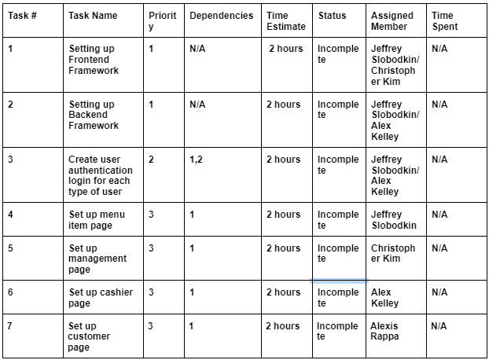

Goal:

Build out an mvp that is functional in allowing managers, cashiers, and customers to use the product. Implement one feature for each of those different types of users mentioned. Also, accessible towards persona specified in the design and management document.

Sprint Backlog:

