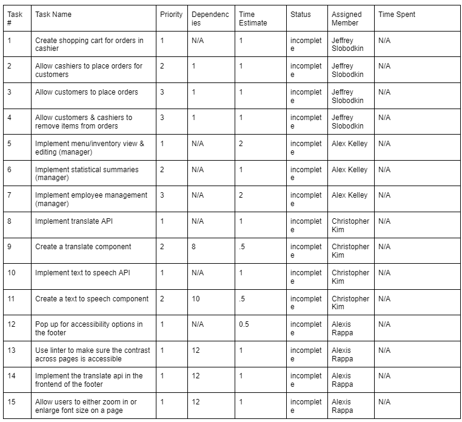

Goal:

The goal for this sprint is to build upon the previous sprint by implementing more functionality and features for the manager and cashiers. Allowing cashiers to place orders for customers as well as allowing customers to place orders themselves. In addition to this, allow the managers to conduct logistical actions on the inventory and menu items.

Sprint Backlog:

