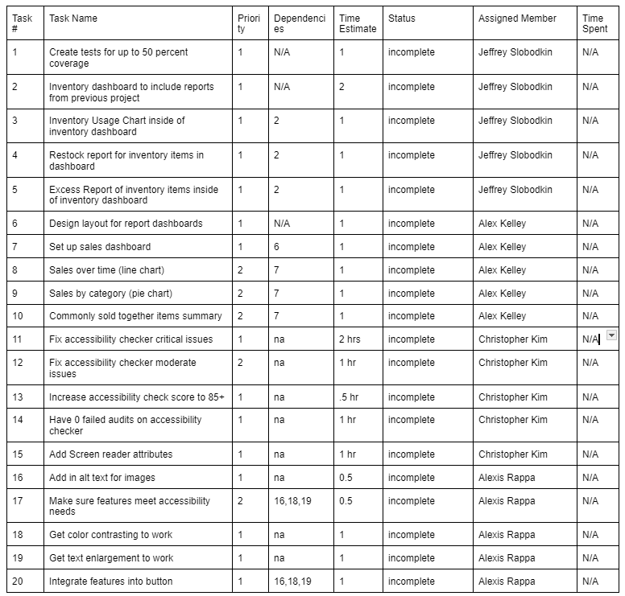

Goal:

The goal for this sprint is to build off of the previous sprint by creating the manager reports in regards to the features from the previous project. In addition to that, make sure that the accessibility is up to par with the linter.

Sprint Backlog:

